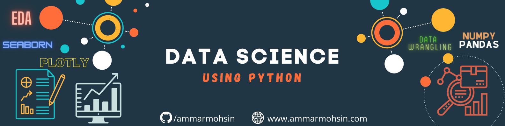

## 🔧 Technologies & Tools

# Data Science using Python
This repository includes integral library for Data Science; NumPy, in which we explore the different functions and usages of 1-Dimensional, 2- Dimensional & 3-Dimensional NumPy Array. Then, we have discussed one of the most important libraries related to Data Science, PANDAS, in which we comprehend different functions and their usages in exploratory data analysis, data cleaning & wrangling.

In the Data Visualization, we have covered important graphical visualization of our data, starting from some basic graphs i.e., Line Plot, Bar Plot, Box Plot, Histograms to the advance and attractive Violin, Strip, Scatter Map-box, Scatter Polar, Bar Polar, Tree map graphs using Plotly. We have used Seaborn, Matplotlib, and Plotly for our Data Visualization and explored the effect of different components in representing these visualizations.

In the Data Preprocessing, we have learned how to handle the raw data. When we collect the raw data, it requires to perform Exploratory Data Analysis (EDA) i.e., initial investigation to discover its patterns, empty values, spot anomalies, test hypothesis, and check assumptions with the help of summary of statistics and graphical representations. After EDA, we have also explored and discussed Data wrangling, which involves processing the data in various formats and analyzing it and getting them to be used with another set of data, and bringing them together into valuable insights. It further includes data aggregation, data visualization, and training statistical models for prediction. Data wrangling is one of the most important steps of the data science process. The quality of data analysis is only as good as the quality of data itself, so it is very important to maintain data quality.

1. [**NumPy in Python for Data Science**](https://github.com/ammarmohsin/Data-Science-using-Python/blob/main/1-Numpy.ipynb) 
    1.	Arrays & Its Types
        1.	1-D Arrays
        2.	2-D Arrays
        3.	3-D Arrays
    2.	Array Functions
        1.	Sorting of Array
        2.	Type of Array
        3.	Length of Array
        4.	Array Concatenation
        5.	Dimension of an Array
        6.	Elements of Array
        7.	Shape of an Array
        8.	Reshaping an Array
        9.	Conversion of Array
        10.	Basic Arithmetic Operations on an Array
        11.	Indexing and Slicing
        12.	Array Stacking & Splitting
    3.	Basic Array Operations
        1.	Basic Operations of 2D Array (Addition, Subtraction, Multiplication & Division)
        2.	Sum of Elements in Array
    4.	Basic Statistical Operations in Arrays
    5.	Indexing 2-D Array
    6.	Random, Reverse, Reshape & Transpose of an Array
    7.	Reshaping and Flattening Multidimensional Arrays

2. [**Pandas in Python for Data Science**](https://github.com/ammarmohsin/Data-Science-using-Python/blob/main/2-Pandas.ipynb)
    1.	Basic Functions of Pandas in Python
    2.	Pandas Library Functions on FAO Data Set
        1.	Set Index
        2.	Data Types
        3.	Head & Tail View of Data Frame
        4.	Convert Data Frame to NumPy Array
        5.	Summary of Data Frame
        6.	Sorting Data Frame
        7.	Selecting Data using Label Based (loc function)
        8.	Selecting Data using Label Based (iloc function)
        9.	Group by in Pandas

3. **Data Visualization**
    1.	Line Plots
    2.	Bar Plots
    3.	Box Plots
    4.	Box Plots Customization
    5.	Exercise
    6.	Plotly

4. **Exploratory Data Analysis (EDA)**
    1.	Cleaning and Filtering Data
    2.	Relationship (Correlation)

5.	**Data Wrangling in Python**
    1.	Dealing with missing values
        1.	Continuous Variables
        2.	Categorical Variables
    2.	Data Formatting
        1.	Data Standardization
    3.	Data Normalization
        1.	Simple Feature Scaling
        2.	Min-Max Method
        3.	Z- score (standard score)
        4.	Log transformation
    4.	Binning
    5.	Convert Categories into Dummies

6.	**Case Study in FAO Dataset**
    1.	Data Handling
    2.	Data Filtration
    3.	Data Visualization

## 📈 Stats

  
  
  

  
  
  

Please follow on followings:

 http://www.ammarmohsin.com/

 https://github.com/ammarmohsin

 https://www.linkedin.com/in/ammar777/

 https://twitter.com/ammarmohsin7

 ammarmohsin104@gmail.com
